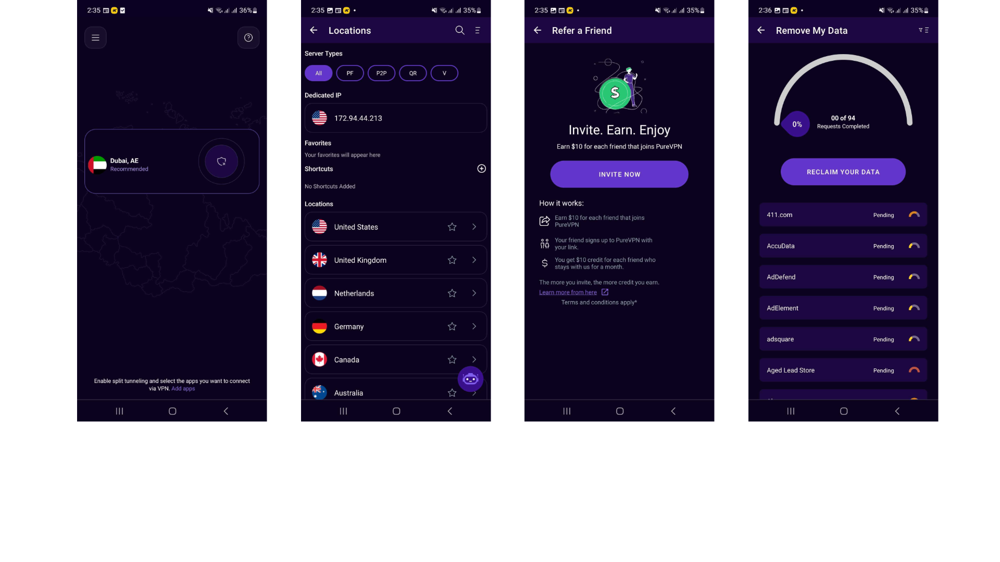

# Noman Noor

With over 11 years of experience in Android development, I have a strong background in Java and Kotlin, and I have
successfully delivered multiple complex and high-quality projects for various clients and industries. In my current
role, I also apply my skills in product management and data-driven insights to lead and mentor a team of developers,
collaborate with stakeholders, and optimize the app's features and performance based on user feedback and metrics.

&nbsp;&nbsp;&nbsp;

# Islam360

As the proud developer of Islam360, a project I have passionately nurtured since 2014, I am excited to showcase a
groundbreaking platform that provides comprehensive access to Islamic resources. Islam360 offers users an immersive
experience, seamlessly integrating Quranic studies, Hadith collections, and scholarly literature. With its user-friendly
interface and advanced search functionalities, Islam360 empowers individuals to delve deep into their faith with ease.
As a developer, I am committed to continually enhancing Islam360's features, ensuring it remains a vital tool for
Muslims worldwide seeking knowledge and guidance.

### Technolgies :

Android SDK, Kotlin, Java,XML, Firebase, RxJava, Android Jetpack Libraries, Firebase, Cloud Functions, AWS EC2, Firebase
Remote config, Firestore, Firebase Auth

<picture>

</picture>

# PureVPN

PureVPN is a leading provider of virtual private network (VPN) services, offering users an array of cutting-edge
features to ensure secure and private internet browsing experiences. The PureVPN Android app extends this functionality
to mobile devices, empowering users with the ability to safeguard their online activities wherever they go.

PureVPN's Android app offers a robust selection of protocols designed to cater to diverse user needs and preferences.
These protocols include OpenVPN (UDP, TCP), IKEv2. Each protocol comes with its unique set of advantages, ranging from
enhanced security to optimized speed and compatibility across various devices and networks.

With PureVPN's versatile protocol options, users can tailor their VPN connection to suit specific requirements, whether
it's prioritizing security, maximizing speed, or ensuring seamless access to restricted content. By offering a
comprehensive suite of protocols, PureVPN empowers users to take control of their online privacy and security
effortlessly, enhancing their digital experiences on Android devices.

### Technolgies :

Android SDK, NDK, openVPN, Firebase, Strongswan, Firebase Remote config

<picture>

</picture>

# Qol360

- Qol360 is a mobile app that helps you learn Quranic Arabic words with English and Urdu meaning.
- It uses a game-based approach with flashcards to make learning fun and engaging.
- The app includes different levels of difficulty to challenge you as you progress.
- You can also track your progress to see how you're doing.

<picture>

  

</picture>

# Hafiz360

Hafiz360 is an Islamic quiz game that helps users memorize Quranic Ayat. Users listen to Quranic Ayat and then choose the matching words in order to complete the verse. The app includes features such as ayat memorization and progress tracking. Some users have requested additional features, such as the ability to choose the order of the words. Overall, the app is rated 4.0 stars on Google Play.

<picture>

  

</picture>

