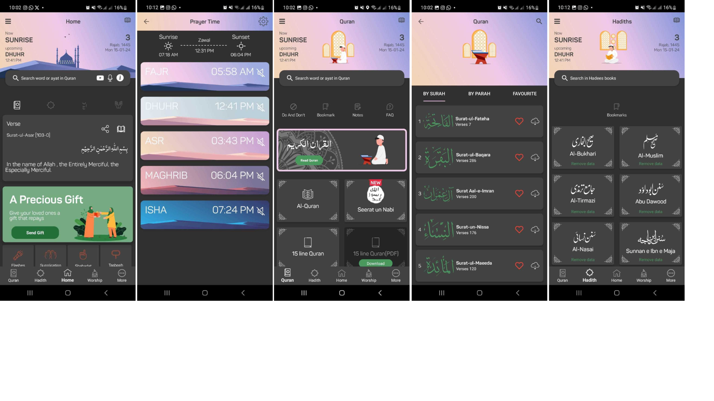

# Noman Noor
With over 11 years of experience in Android development, I have a strong background in Java and Kotlin, and I have successfully delivered multiple complex and high-quality projects for various clients and industries. In my current role, I also apply my skills in product management and data-driven insights to lead and mentor a team of developers, collaborate with stakeholders, and optimize the app's features and performance based on user feedback and metrics.

&nbsp;&nbsp;&nbsp;

# Islam360
As the proud developer of Islam360, a project I have passionately nurtured since 2014, I am excited to showcase a groundbreaking platform that provides comprehensive access to Islamic resources. Islam360 offers users an immersive experience, seamlessly integrating Quranic studies, Hadith collections, and scholarly literature. With its user-friendly interface and advanced search functionalities, Islam360 empowers individuals to delve deep into their faith with ease. As a developer, I am committed to continually enhancing Islam360's features, ensuring it remains a vital tool for Muslims worldwide seeking knowledge and guidance.

### Technolgies : 
Android SDK, Kotlin, Java,XML, Firebase, RxJava, Android Jetpack Libraries, Firebase, Cloud Functions, AWS EC2, Firebase Remote config, Firestore, Firebase Auth

